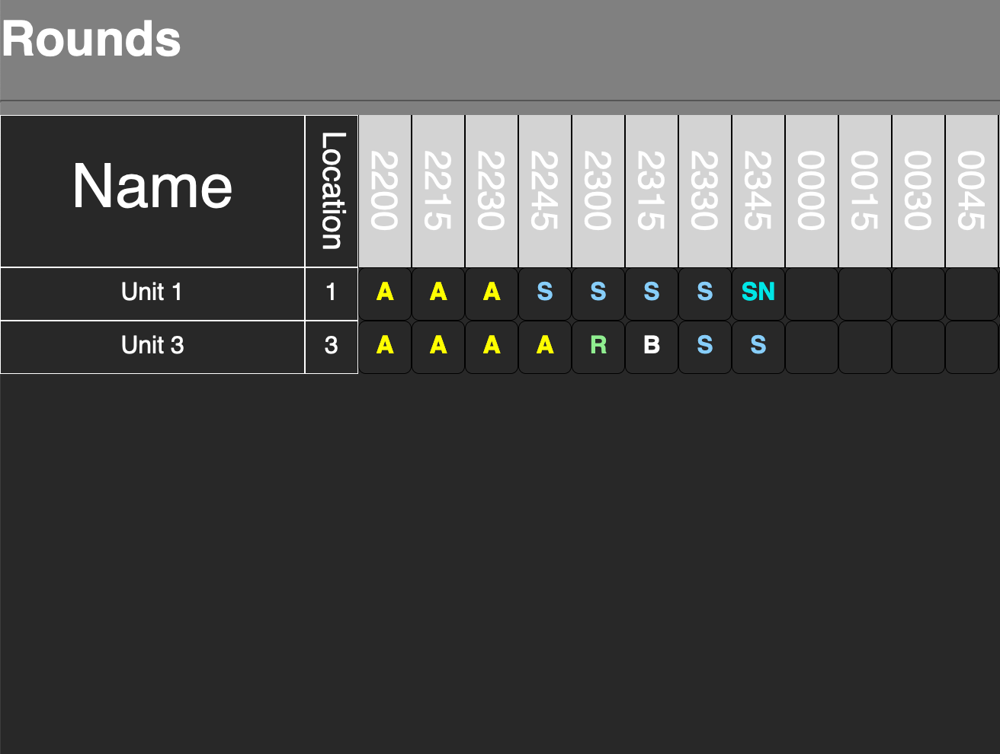

# Rounds

Inspired by jobs with regular data recording requirements and the pain of editing spreadsheets on a phone, Rounds is a web application for tracking data at frequent intervals with a focus on mobile-friendly UI that minimizes poking at too-small cells and squinting at tiny font sizes.

This is a work in progress, with the front-end mostly built React/Redux. Currently, most of the event handlers for simplified "spreadsheet-lite" functionality are in place. Aims for future development include:

- MongoDB for data storage
- Node.js backend
- GraphQL API
- Automated number-crunching, graphs and charts, etc.
- Dashboard for customizing datasheets

## Features

To make data input as quick and easy as possible, a user can select one or many cells and populate all of them with a single button press or keystroke. A modal will pop up when cells are selected, allowing quick selection of data values common to your organization's processes. The modal and cell selection persist for a few seconds afterward, allowing for quick corrections.

Because you won't need the depth and breadth of tools that come with software like Excel or Google Sheets, the UI is much simpler. In addition, the streamlined functionality makes Rounds a much faster, less resource-intensive app, thus saving battery life.

## Usage

Test the current build at the deploy link below, or clone the repository to run the app locally. Although the backend is still in its nascence, you'll need to run `npm start` from the root directory, then view localhost:3002/ in your browser.

## Deployed Preview

Preview the app at https://gavin-asay.github.io/rounds/.

